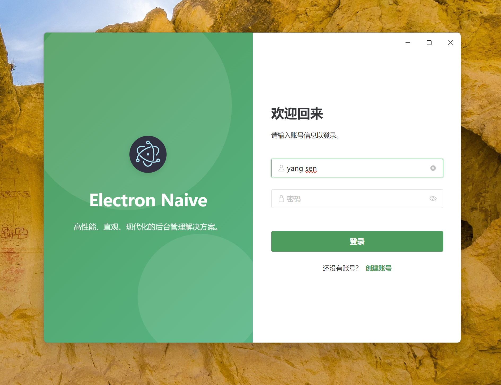
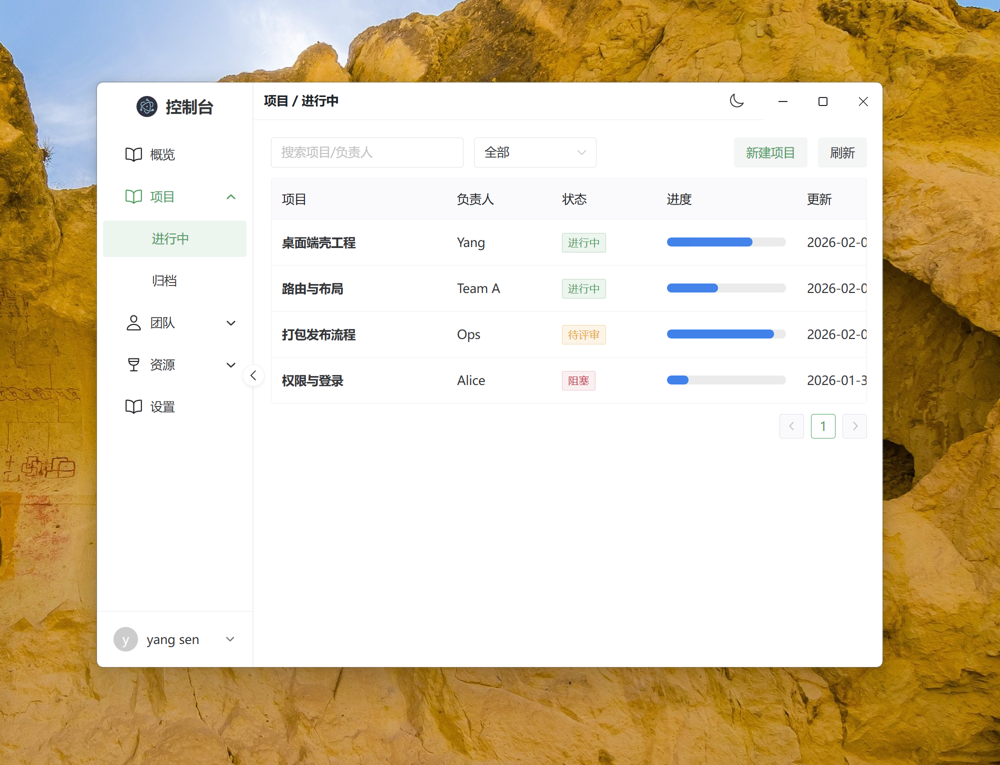
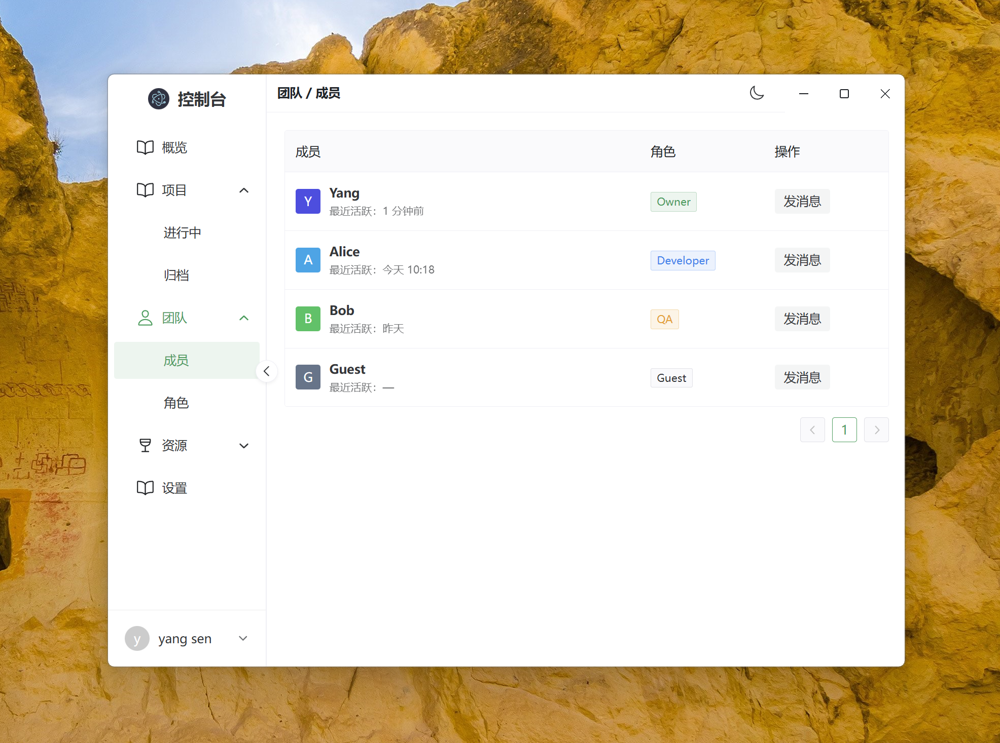
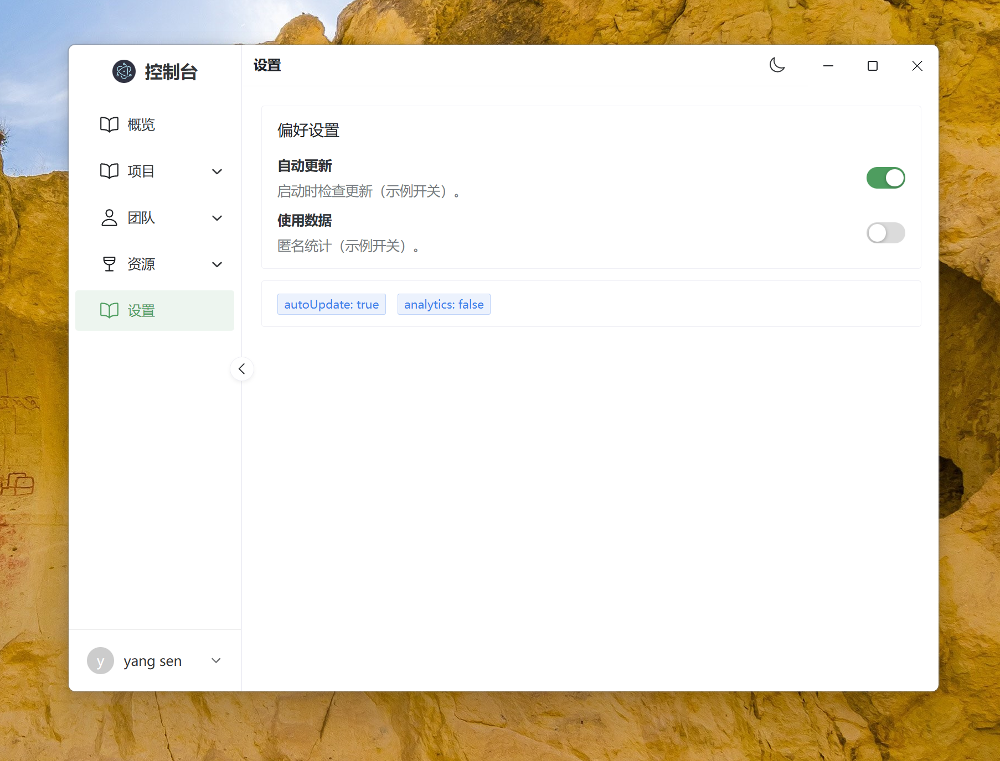
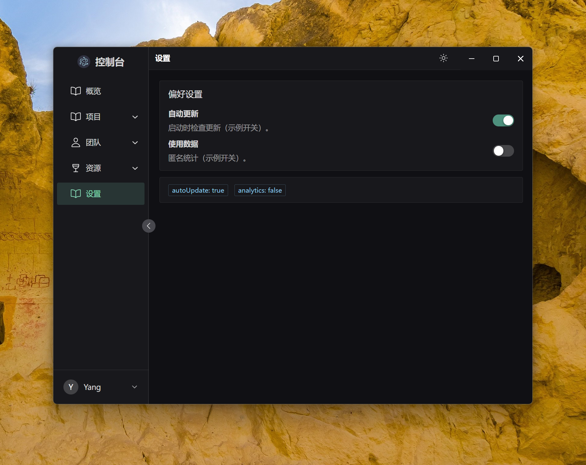

# electron-naiveui-template

一套可直接复用的桌面端工程模板，基于 **Electron + electron-vite + Vue 3 + TypeScript + Naive UI**，内置后台管理类界面示例（登录页、侧边栏布局、路由守卫、暗黑模式与基础页面）。

## 特性

- **标准工程分层**：Main / Preload / Renderer 目录结构清晰，便于扩展与维护
- **路由与登录态示例**：Vue Router（`hash`，适配 `file://`）+ localStorage 登录态
- **Naive UI 示例**：布局、菜单、表格、表单等页面可直接改造
- **主题同步**：渲染进程暗黑模式，并通过 IPC 同步到系统 `nativeTheme`
- **标题栏融合（Win/Linux）**：`titleBarOverlay` 随主题变化动态调整标题栏颜色

## 界面截图

| 登录 | 项目 |
| --- | --- |
|  |  |

| 团队 | 设置 |
| --- | --- |
|  |  |



## 技术栈

- Electron + electron-vite
- Vue 3 + TypeScript
- Naive UI + Vue Router
- electron-builder（打包）
- electron-updater（可选：自动更新）

## 环境要求

- Node.js：建议 **18+**
- 包管理器：npm（本仓库默认）
- Windows 打包：需要可用的构建环境（如遇原生依赖构建失败，请安装对应工具链）

## 快速开始

```bash
npm install
npm run dev
```

## 常用脚本

| 命令 | 说明 |
| --- | --- |
| `npm run dev` | 本地开发（HMR） |
| `npm run build` | 构建（仅编译） |
| `npm run start` | 预览运行构建产物 |
| `npm run build:unpack` | 打包为目录产物（不生成安装包） |
| `npm run build:win` | Windows 安装包 |
| `npm run build:mac` | macOS 安装包 |
| `npm run build:linux` | Linux 安装包 |
| `npm run lint` | ESLint 检查 |
| `npm run typecheck` | TypeScript 类型检查 |
| `npm run format` | Prettier 格式化 |

## 使用模板

### 方式 A：GitHub「Use this template」

1. 先在仓库 `Settings -> General` 勾选 `Template repository`
2. 回到仓库首页点击 **Use this template** 创建你自己的仓库
3. 克隆新仓库并开始开发

### 方式 B：克隆后断开历史

```bash
git clone <你的仓库地址> my-app
cd my-app
rm -rf .git
git init
git add .
git commit -m "init: from electron-naiveui-template"
```

Windows PowerShell：

```powershell
git clone <你的仓库地址> my-app
cd my-app
Remove-Item -Recurse -Force .git
git init
git add .
git commit -m "init: from electron-naiveui-template"
```

## 初始化配置（建议尽早修改）

应用标识相关（影响安装包名、更新、系统识别等）：

- `package.json`：`name` / `version` / `description`
- `electron-builder.yml`：
  - `appId`（建议使用反向域名，如 `com.yourcompany.yourapp`）
  - `productName`（安装包展示名）
  - `win.executableName`（Windows 可执行文件名）
- `dev-app-update.yml`：`updaterCacheDirName`（更新缓存目录名）
- `src/main/index.ts`：`electronApp.setAppUserModelId(...)`（Windows AppUserModelId，建议与 `appId` 同域）
- `resources/icon.png`：应用图标（Linux 窗口图标示例已引用）

## 工程结构

```
src/
  main/      # Electron 主进程
  preload/   # 预加载（contextBridge）
  renderer/  # 渲染进程（Vue + Naive UI）
```

路径别名：`electron.vite.config.ts` 配置了 `@renderer -> src/renderer/src`。

## IPC / Preload（安全建议）

模板在 `src/preload/index.ts` 暴露了：

- `window.electron`：来自 `@electron-toolkit/preload` 的 Electron API 包装
- `window.api`：预留的自定义桥接 API（默认空对象）

建议将所有自定义 IPC 能力封装在 `window.api` 中，仅暴露必要的最小接口，并在 `src/preload/index.d.ts` 中补齐类型定义。

## 自动更新（可选）

工程已包含 `electron-updater` 依赖，并提供示例配置：

- `dev-app-update.yml`
- `electron-builder.yml` 的 `publish`

说明：当前主进程未内置自动更新逻辑。若需要启用，请在主进程接入 `autoUpdater`（例如在 `app.whenReady()` 后调用 `checkForUpdatesAndNotify()`），并将 `publish` 替换为你的真实发布渠道（如 `github` / `generic` / 私有更新服务）。

### 方案二：Distromate 分发助手

感谢 <a href="https://www.distromate.net/">Distromate 分发助手</a> 提供支持

<a href="https://www.distromate.net/"></a>

## 推荐 IDE

- VSCode + ESLint + Prettier + Volar
